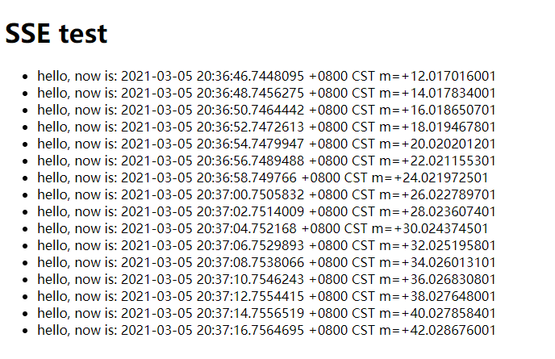
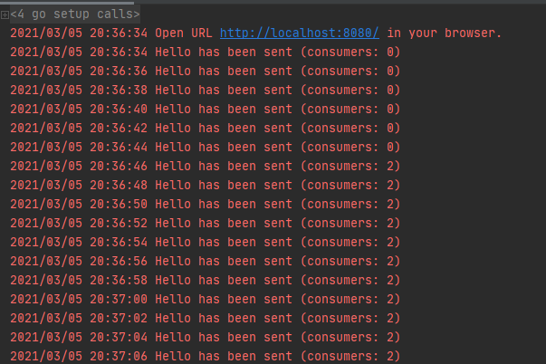

## 使用Golang实现服务端推送SSE例子

项目依赖：

-   https://github.com/antage/eventsource/tree/v1

### 使用方法

下载依赖：

```bash
go mod tidy
```

启动SSE后台：

```bash
go run app.go
```

访问http://localhost:8080/，可以看到页面收到服务器主动推送时间：



同时服务器输出日志及客户端连接数：



### 其他

相关博文：

-   Github Pages：[使用Go实现服务端事件推送SSE](https://jasonkayzk.github.io/2021/03/05/%E4%BD%BF%E7%94%A8Go%E5%AE%9E%E7%8E%B0%E6%9C%8D%E5%8A%A1%E7%AB%AF%E4%BA%8B%E4%BB%B6%E6%8E%A8%E9%80%81SSE/)
-   国内Gitee镜像：[使用Go实现服务端事件推送SSE](https://jasonkay.gitee.io/2021/03/05/%E4%BD%BF%E7%94%A8Go%E5%AE%9E%E7%8E%B0%E6%9C%8D%E5%8A%A1%E7%AB%AF%E4%BA%8B%E4%BB%B6%E6%8E%A8%E9%80%81SSE/)

