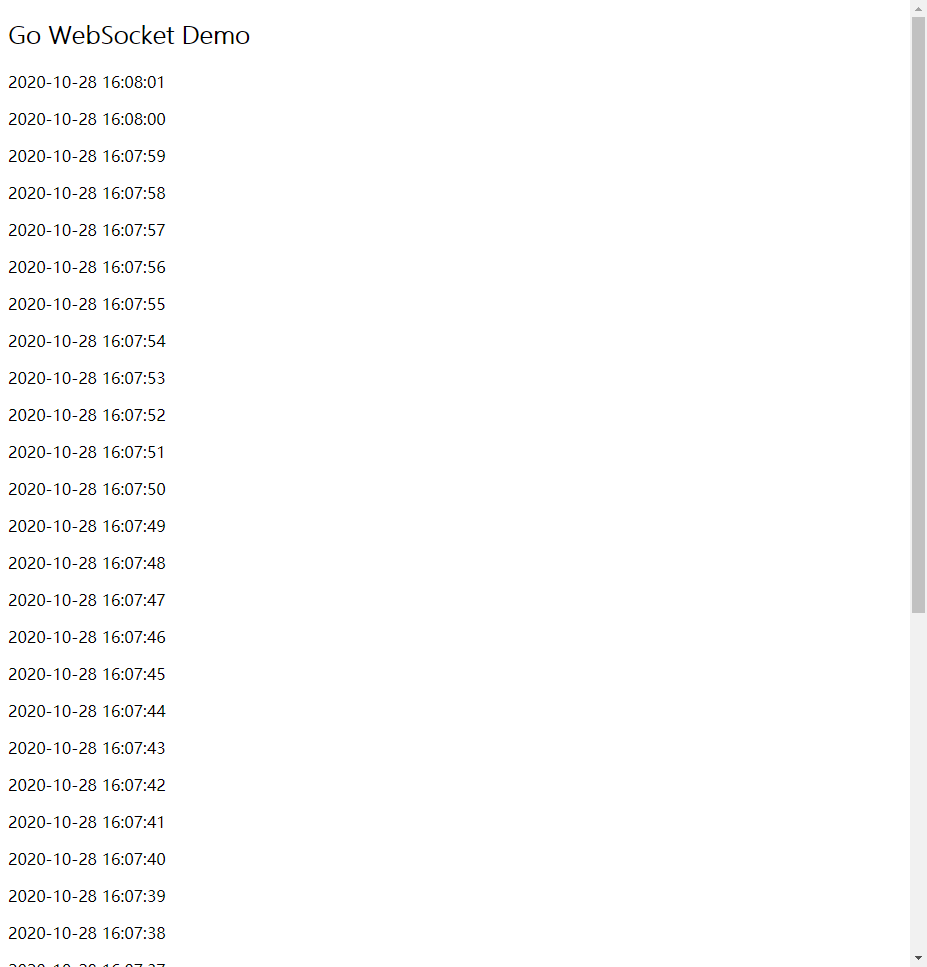

## WebSocket

A branch for WebSocket demo.

### 依赖

本项目使用[gorilla/websocket](https://github.com/gorilla/websocket)实现

### 使用

启动websocket服务器：

```bash
go run websocket.go
```

在浏览器中打开index.html即可；

每秒服务端会推送当前服务器的时刻，如下：



### 更多说明

见博文：
- [使用golang构建简单的websocket应用](https://jasonkayzk.github.io/2020/10/28/使用golang构建简单的websocket应用/)
